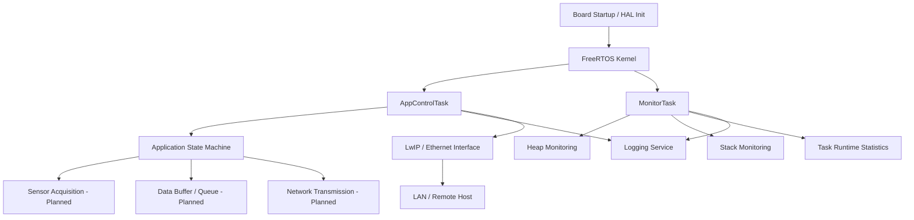

# Smart Data Acquisition

## Project Purpose

This project targets an STM32F746-based embedded data acquisition platform built with STM32CubeIDE, FreeRTOS, and LwIP.

The main goal is to create a modular firmware foundation that can:

- initialize the hardware platform and board support layer,
- run application logic under FreeRTOS,
- provide runtime logging and health monitoring,
- acquire measurement data from future sensor modules,
- prepare, buffer, and transmit collected data over Ethernet.
- run on-device AI inference for anomaly detection, event classification, or local decision support.

The current codebase is structured as a reusable platform rather than a one-off firmware example. It is intended to evolve into a reliable network-enabled data collector with clear separation between application, BSP, and service layers.

## Current Development Status

The project is currently in the platform bring-up and infrastructure validation stage.

What is already implemented:

- STM32CubeIDE project structure and build configuration
- HAL-based MCU initialization and startup files
- FreeRTOS task-based application framework
- Ethernet and LwIP integration
- UART-based logging service
- Runtime monitoring for heap, stack usage, and task statistics
- Application control task with basic state-machine structure
- Periodic network status reporting

What is currently validated:

- the project can be opened and built from STM32CubeIDE,
- the firmware boots and runs under FreeRTOS,
- Ethernet initialization and IP stack startup are functional,
- basic network communication and runtime diagnostics are available.

What is still placeholder or partially implemented:

- real sensor acquisition
- measurement buffering and queueing
- application-level data packaging
- remote data upload, such as HTTP or another protocol
- production-grade fault handling and recovery policies

## Planned Development Stages

The expected next stages are:

1. Sensor integration
	Add actual sensor drivers and connect them to the application layer.

2. Data acquisition pipeline
	Read measurements periodically, validate them, and move them into a buffer or queue.

3. Data packaging and transport
	Define how sampled data is encoded and transmitted over Ethernet.

4. Remote communication service
	Implement the uplink path for sending collected data to a server or backend system.

5. Reliability and diagnostics
	Improve error recovery, watchdog integration, link supervision, and runtime observability.

6. Production hardening
	Finalize configuration management, persistent settings if needed, and deployment-ready behavior.

7. Edge AI integration
	Evaluate and integrate lightweight on-device AI inference for real-time analytics, such as anomaly detection or classification, while respecting STM32F746 CPU, RAM, and latency constraints.

## High-Level Architecture

## Software Layers

- `Core/`: STM32Cube-generated startup and peripheral initialization
- `LWIP/`: network stack integration and Ethernet interface glue
- `Platform/Application/`: application-level tasks and control logic
- `Platform/Services/`: reusable services such as logging and monitoring
- `Platform/BSP/`: board support components and hardware abstraction helpers

## Current Focus

The current focus is to keep the firmware base stable, portable, and easy to build from STM32CubeIDE while preparing the application architecture for real data acquisition features.

In short, the project is no longer just a blank MCU template, but it is not yet a complete end-to-end data collection product. It is in the transition phase between platform bring-up and application feature development.

The long-term product direction will include edge intelligence as part of the data processing pipeline.